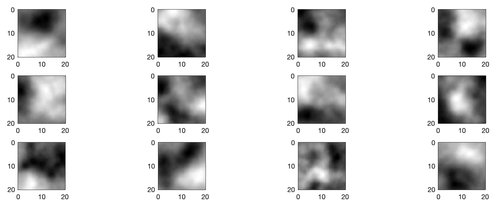
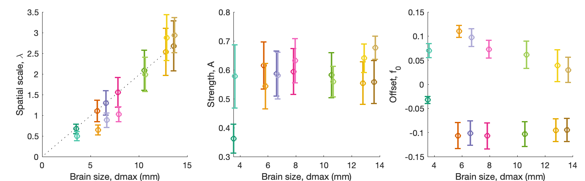

# Modeling the spatial embedding of gene expression across mouse brain development

Code for reproducing the modelling presented in:
H.Y.G. Lau, B.D. Fulcher, A. Fornito. [Scaling of gene transcriptional gradients with brain size across mouse development](https://doi.org/10.1101/2020.06.04.135525), _bioRxiv_ (2020).

This repository contains code for the modelling component; code for the main data analysis from this paper is in [this repository](https://github.com/NeuralSystemsAndSignals/DevelopingMouse).

Please add the support functions in the `Peripheral` directory by running `startup`.

#### Visualizing some example simulated gradients

```matlab
ForSchematic
```
Allows you to visualize some example outputs of the spatial lag model with specific parameters in an example 20 x 20 square grid:




#### Optimization

An initial step is to get the model parameters in a good part of the space, using `optimization`.
The optimized values can then be set in `GiveMeDefaultParameters`.

#### Modelling
The modelling across time is done in `simulateGrid`.
Running this across many iterations is done in `GetWithErrorBars`.

For example in the paper we used 50 repeats of the model (each repeat going across the seven developmental time points) to estimate means and standard deviations of model fits across runs:
```matlab
numRepeats = 50;
GetWithErrorBars(numRepeats)
```
This saves the figure out to `Model_Simo_50Reps.svg` as:


